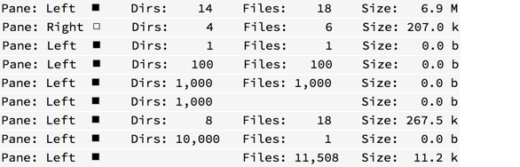

# Changelog
All notable changes to this project will be documented in this file

## [Unreleased]
  [ Unreleased]: https://github.com/kek91/StatusBarExtended/compare/v0.4.0...HEAD

## [v0.4.0 — 13.08.2021]
  [ v0.4.0 — 13.08.2021]: https://github.com/kek91/StatusBarExtended/releases/tag/v0.4.0
  - __Added__
    + :sparkles: User-configurable options via the `configure_status_bar_extended` command aliased as `StatusBarExtended: configure` in the Command Palette and bound to <kbd>Shift</kbd><kbd>F3</kbd> by default

        |     Option    	|  Default   	|                  Description                                    	|
        | :-------------	| :--------: 	| :-----------------------------------------                      	|
        | Enabled       	| `True`     	|  Enable/Disable this plugin                                     	|
        | SizeDivisor   	| `1024`     	|  File size format: decimal (1k=1000=10³) or binary (1k=1024=2¹⁰)	|
        | MaxGlob       	| `5000`     	|  Skip folders with as many items (folders+files)                	|
        | SymbolPane    	| `◧` `◨`    	|  `Left`/`Right` pane symbol                                     	|
        | SymbolHiddenF 	| `◻` `◼`    	|  Hidden files `Shown`/`Hidden` symbol                           	|
        | HideDotfile   	| `False`    	|  Treat .dotfiles as hidden files on Windows                     	|
        | Justify       	| `5` `5` `7`	|  Minimum width of the `Folder`/`File`/`Size` values             	|

    + :sparkles: A command to view current configuration (`view_configuration_status_bar_extended` aliased as `StatusBarExtended: view current configuration settings` in Command Palette)

  - __Fixed__
    + :beetle: selection updating on each cursor move even when without a `toggle_selection` argument
    + :beetle: update function called 3 times per path change (one extra for each `from statusbarextended import StatusBarExtended`)
    + :beetle: each pane calling the status bar update instead of only the left one (currently also the active one)

## [v0.3.1 — 07.08.2021]
  [ v0.3.1 — 07.08.2021]: https://github.com/kek91/StatusBarExtended/releases/tag/v0.3.1
  - __Fixed__
    + :beetle: Hidden non-dotfiles always counted; (Windows) dotfiles (even without the 'hidden' attribute) not counted if option is set to hide
    + :beetle: Status bar is NOT updated when a _visible_ hidden file/folder is _selected_ and then _hidden_ via `Toggle hidden files`

## [v0.3.0 — 07.08.2021]
  [ v0.3.0 — 07.08.2021]: https://github.com/kek91/StatusBarExtended/releases/tag/v0.3.0
  - __Fixed__
    + :beetle: Hidden files not counted even when they're shown
    + :beetle: Not updating on pane changes via keyboard `switch_panes` command (e.g. with a <kbd>Tab</kbd>)

## [v0.2.1 — 05.08.2021]
  [ v0.2.1 — 05.08.2021]: https://github.com/kek91/StatusBarExtended/releases/tag/v0.2.1
  - __Changed__
    + The currently active pane indicator from `Pane: Left`/`Pane: Right` to `◧`/`◨` 
    + The `Dirs:`/`Files:` indicators' to align with and without selection

## [v0.2.0 — 05.08.2021]
  [ v0.2.0 — 05.08.2021]: https://github.com/kek91/StatusBarExtended/releases/tag/v0.2.0
  - __Fixed__
    + :beetle: Not working with the latest fman version (`1.7.3`) and its new file system API ([blog](https://fman.io/blog/fmans-new-file-system-api/), [API](https://fman.io/docs/api#FileSystem))

## [v0.1.2 — 15.08.2017]
  [ v0.1.2 — 15.08.2017]: https://github.com/kek91/StatusBarExtended/releases/tag/v0.1.2
  - Shorter size indicators with lower-case for (kilo)bytes: `b, k, M, G, T`. Kibibyte (`2^10`) format is preserved
  - Change the status icon of hidden files toggle to `◻`white (hidden files shown) and `◼`black (hidden files hidden) Unicode square symbols
  - Align all indicator position to keep it the same regardless of the length of the indicator (file/folder count is consistent up to `9,999`)
  - Remove empty folder/file numbers indicators (including labels)
  
  - Add thousands separator (`,`) to file/folder numbers (e.g. `Files: 1,000`)
  - Change status of selected items to be consistent with the regular view for faster read

## [v0.1.1 — 06.04.2017]
  [ v0.1.1 — 06.04.2017]: https://github.com/kek91/StatusBarExtended/releases/tag/v0.1.1
  - Show binary prefix instead of decimal for file size

## [v0.1.0 — 01.03.2017]
  [ v0.1.0 — 01.03.2017]: https://github.com/kek91/StatusBarExtended/releases/tag/v0.1.0
  - Shows output only for the currently active pane due to layout/resize issues 
  - Don't display "Files: n" and "Size: n xB" if there are 0 files in current directory
  - Hidden status is visualized by checkmark or cross

**25.02.2017:**

  - Align text to the left and right for the respective panes
  - Reduce text to make the status bar smaller thus allowing resizing window smaller

**19.01.2017:**

  - Shows selected directores and files/filesize when selecting files
  - Restructured code for readability

**16.01.2017:**

  - StatusBar shows immediately when toggled

**28.11.2016:**

  - Cleaned code
  - Should work in all 3 supported OS (tested on Windows and Linux only)
