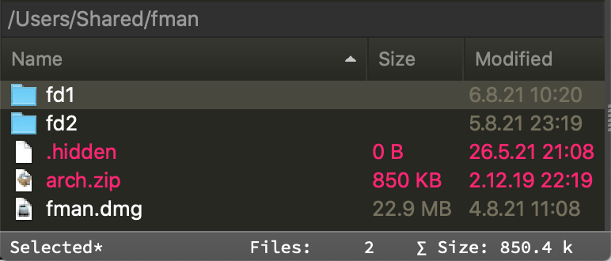

# StatusBarExtended

Extends the status bar in fman to show additional information.

Turn the plugin on or off by using a keyboard shortcut, default is <kbd>F3</kbd>.

Configure the plugin by using a keyboard shortcut, default is <kbd>Shift</kbd><kbd>F3</kbd>.

**Features**

Adds extra information to the status bar.

- Show the number of directories/files and the total size of files in the current directory for both panes
- Show "Toggle hidden files" status (`◻` shown `◼` hidden)
- Show the number of selected directories/files and the total size of selected files
- Show the currently active pane indicator (`◧` left `◨` right)

Aligns indicator positions to avoid "jitter" on selection/navigation

Allows a user to configure all the options via the `configure_status_bar_extended` command aliased as `StatusBarExtended: configure` in the Command Palette:

  |     Option    	|  Default                       	|                  Description                                               |
  | :-------------	| :-----------------------------:	| :------------------------------------------------------------------------- |
  | Enabled       	| `True`                         	|  Enable or disable this plugin                                             |
  | SizeDivisor   	| `1024`                         	|  File size format: decimal (1k=1000=10³) or binary (1k=1024=2¹⁰)           |
  | MaxGlob       	| `5000`                         	|  Skip folders with as many items (folders+files)                           |
  | Label         	| `Dirs:` `Files:` `Size:` 	|  `Folder`/`File`/`Size` labels (__tip__: try `🗀` `🗁` `🖿` `📁` `📂` `📝`) |
  | Hide0Label    	| `True`                         	|  Hide labels when 0 folders/files                                          |
  | SymbolPane    	| `◧` `◨`                        	|  `Left`/`Right` pane symbol                                                |
  | SymbolHiddenF 	| `◻` `◼`                        	|  Hidden files `Shown`/`Hidden` symbol (__tip__: try `👁` `👀👓` `✓✗` `◎◉` `🐵🙈`) |
  | HideDotfile   	| `False`                        	|  Treat .dotfiles as hidden files on Windows                                 |
  | Justify       	| `5` `5` `7`                    	|  Minimum width of the `Folder`/`File`/`Size` values, e.g. 5,321    21 |

**Preview**

|       Status Bar without selection       |        Status Bar with selection         |
| :--------------------------------------: | :--------------------------------------: |
|  |  |

|       Status Bar alignment       |
| :------------------------------: |
|  |

__Known issues__

- Status bar is NOT updated when _switching panes_ with a _mouse_ since plugins can't notice a pane switch due to a lack of the [necessary APIs](https://github.com/fman-users/fman/issues/292#issuecomment-360036718)
- Alignment of indicators only works for _monospaced_ (fixed-width) fonts since it's currently implemented using regular spaces (__tip__: you can change this font in your `Theme.css` file `.statusbar{font-family:"yourMonospacedFont"}`). And even then fancy icons/emojis might slightly break it (__tip__: setting `Hide0Label` to `False` might help)
- On launch the right pane is ignored in the status bar udpate to improve performance since fman always activates the left one (and doesn't have an API to let a plugin know which pane is the active one)
