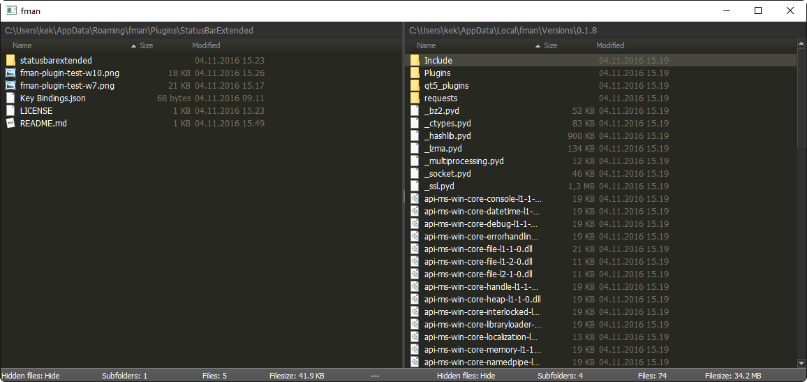

# StatusBarExtended

This is a simple plugin for the modern file manager "fman.io" which extends the functionality of the status bar.
**Currently only for testing and playing around with fman API. Consider the plugin broken at all times!**

Install by uploading "StatusBarExtended" to your [data directory](https://fman.io/docs/customizing-fman)`/Plugins`.

Turn the plugin on or off by using the keyboard shortcut, default is **F3**.

**Features**

 - Show number of files/directories in current directory for both panes
 - Show total filesize for all files in current directory for both panes
 - Tell if hidden files are shown or hidden

**Todo**

 - ~~Update status bar when switching pane~~
 - Progress bar for IO operations
 - Show number of files and filesize for currently selected files if any files are selected
 - Clean up the json code mess - replace import python json with fmans builtin functions
 - ~~Include files without file extension as well (currently doing `glob *.*`)~~
 - Refresh status bar when toggling Show/Hide hidden files (`CTRL + .`).  
 Currently it only refreshes on `on_path_changed()`
 - Make the status bar responsive (if possible, str.format() and str.rjust() doesn't apply)
 - ++

**Screenshots**

** Screenshots old version **

