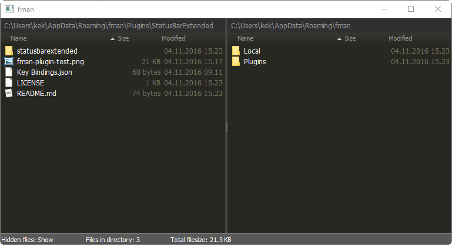
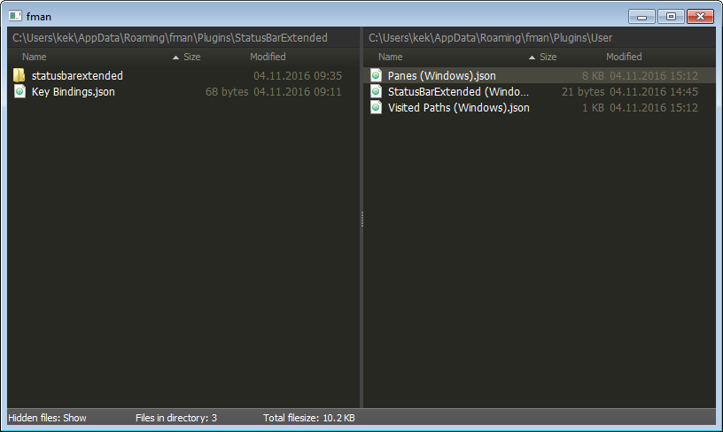

# StatusBarExtended

This is a simple plugin for the modern file manager "fman.io" which extends the functionality of the status bar.

Currently only for testing and playing around with fman API. Consider the plugin broken at all times.

Install by uploading "StatusBarExtended" into your Plugins folder which is found inside your [data directory](https://fman.io/docs/customizing-fman).

Turn the plugin on or off by using the keyboard shortcut, default is **F3**.

Features

 - Show number of files in current dir
 - Show total filesize of files in current dir
 - Tell if hidden files are shown or hidden

Todo:

 - Update status bar when switching pane
 - Progress bar for IO operations
 - Show number of files and filesize for currently selected files if any files are selected
 - Clean up the json code mess - replace import python json with fmans builtin functions
 - ++
 
Screenshot:

