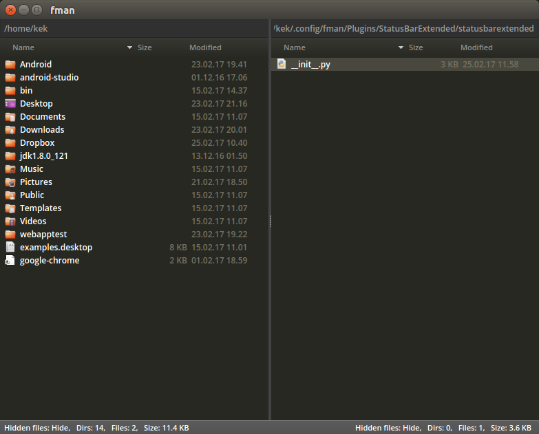
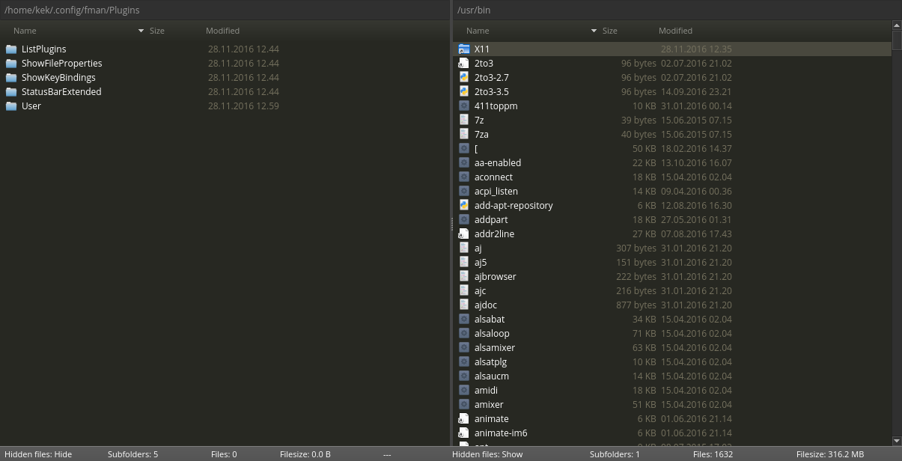

# StatusBarExtended

This is a simple plugin for the modern file manager "fman.io" which extends the functionality of the status bar.

Install by uploading "StatusBarExtended" to your [data directory](https://fman.io/docs/customizing-fman)`/Plugins`.

Turn the plugin on or off by using the keyboard shortcut, default is **F3**.

**Features**

Adds extra information to the status bar.

 - Show number of directories and files/size in current directory for both panes
 - Show "Toggle hidden files" status
 - Show directories and files/size when selecting files

**Changelog**

- 25.02.2017:
 - Align text to the left and right for the respective panes
 - Reduce text to make the status bar smaller thus allowing resizing window smaller

- 19.01.2017:
 - Shows selected directores and files/filesize when selecting files
 - Restructured code for readability

- 16.01.2017:
 - StatusBar shows immediately when toggled

- 28.11.2016:
 - Cleaned code
 - Should work in all 3 supported OS (tested on Windows and Linux only)

**Screenshots**

fman v0.2.9 on Ubuntu 16.04.

fman v0.2.0 on elementaryOS.

fman 0.1.0 on Windows 10:

