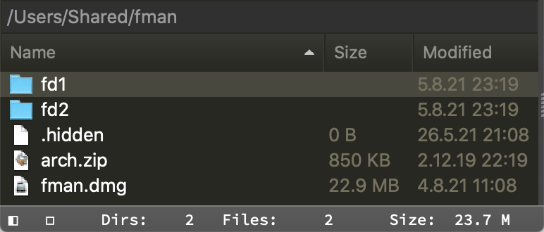

# StatusBarExtended

Extends the status bar in fman to show additional information.

Turn the plugin on or off by using the keyboard shortcut, default is **F3**.

**Features**

Adds extra information to the status bar.

- Show the number of directories/files and the total size of files in the current directory for both panes
- Show "Toggle hidden files" status (`◻` shown `◼` hidden)
- Show the number of selected directories/files and the total size of selected files
- Show the currently active pane indicator (`◧` left `◨` right)

**Preview**

|       Status Bar without selection       |        Status Bar with selection         |
| :--------------------------------------: | :--------------------------------------: |
|  |  |

__Known issues__

- Alignment of indicators only works for monospaced (fixed-width) fonts since it's currently implemented using regular spaces (tip: you can change this font in a theme)
- Status bar is NOT updated when moving to another pane with a mouse since plugins can't notice a pane switch due to a lack of the [necessary APIs](https://github.com/fman-users/fman/issues/292#issuecomment-360036718)
