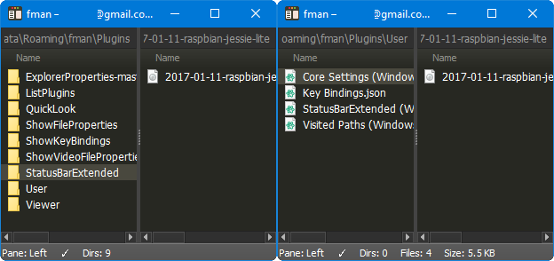
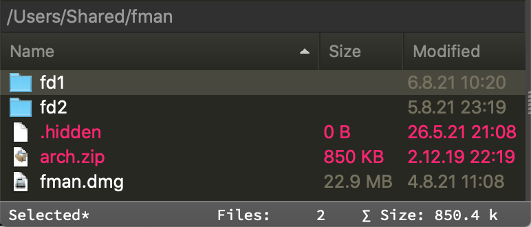

# StatusBarExtended

Extends the status bar in fman to show additional information.

Turn the plugin on or off by using the keyboard shortcut, default is **F3**.

**Features**

Adds extra information to the status bar.

- Show the number of directories/files and the total size of files in the current directory for both panes
- Show "Toggle hidden files" status (`◻` shown `◼` hidden)
- Show the number of selected directories/files and the total size of selected files
- Show the currently active pane indicator (`◧` left `◨` right)

Aligns indicator positions to avoid "jitter" on selection/navigation

**Preview**

|       Status Bar without selection       |        Status Bar with selection         |
| :--------------------------------------: | :--------------------------------------: |
|  |  |

|       Status Bar alignment       |
| :------------------------------: |
|  |

__Known issues__

- fman raises `ValueError` on the first `Toggle hidden files` if a pane is _launched_ with hidden files _hidden_ (and status bar is not updated this one time)
- Status bar is NOT updated when a _visible_ hidden file is _selected_ and then _hidden_ via `Toggle hidden files`
- Status bar is NOT updated when _switching panes_ with a _mouse_ since plugins can't notice a pane switch due to a lack of the [necessary APIs](https://github.com/fman-users/fman/issues/292#issuecomment-360036718)
- Alignment of indicators only works for _monospaced_ (fixed-width) fonts since it's currently implemented using regular spaces (tip: you can change this font in your `Theme.css` file `.statusbar{font-family:"yourMonospacedFont"}`). Dir/file count alignment is limited to up to 9,999
- On launch the status bar reflects the status of the _right_ pane
